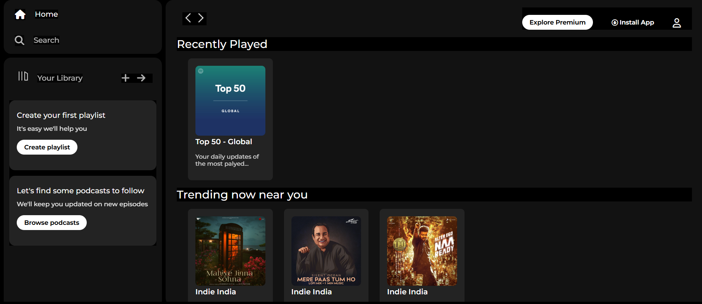
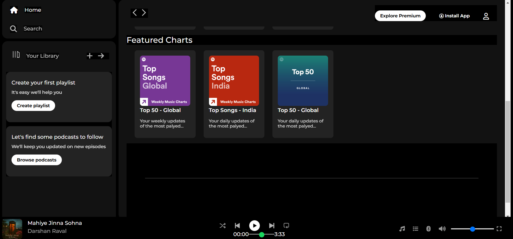

🎧 Spotify Clone - Web Player UI
A simple and clean static clone of the **Spotify Web Player UI**, built with only **HTML and CSS**. 

📸 Screenshot

Here’s a preview of the Spotify Clone UI built with HTML and CSS:



🌟 Features

✅ Sidebar with menu options like:
- Home
- Search
- Your Library

✅ Section for:
- Recently Played
- Trending Now Near You
- Featured Charts

✅ Bottom sticky music player with playback controls

✅ Custom hover effects for interactive UI

✅ Google Fonts and Font Awesome Icons integration

✅ Built for learning and practice (Not fully responsive yet)

🛠️ Technologies Used

- HTML5  
- CSS3 (Flexbox & Grid)  
- Font Awesome Icons  
- Google Fonts (Montserrat)

🚀 How to Run

1. **Clone the repository:**
```bash
git clone https://github.com/jahnavi-16-12/spotify-clone.git
```
2. Open the folder in VS Code or any editor of your choice.

3. Open index.html in your browser to view the clone.

📂 Folder Structure
spotify-clone/
│
├── index.html
├── style.css
├── assets/
│   ├── logo.png
│   ├── card1img.jpeg
│   ├── card2img.jpeg
│   ├── player_icon1.png
│   └── ... (other images)
└── README.md

🤝 Contributing

This project is made for learning purposes, but feel free to fork it, suggest improvements, or add new features to enhance it further.
📩 Contact

If you have any questions, feel free to connect with me on LinkedIn(www.linkedin.com/in/jahnavigoud16)
